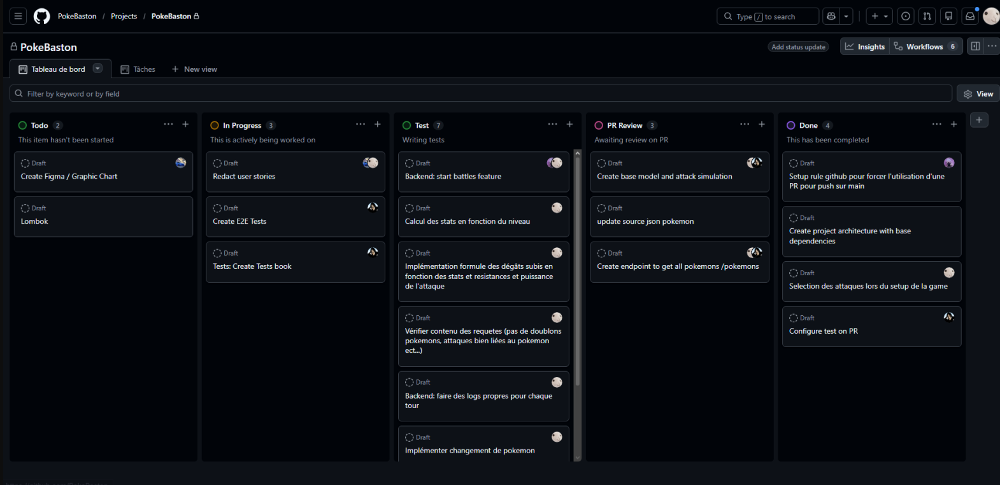
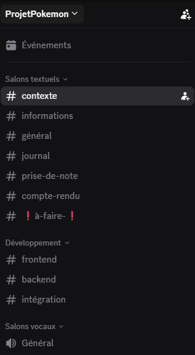

# 📝 Synthèse de Projet : Simulateur PokeBaston

**Équipe :**  Thomas, Thibault, Mike, Rayen, Doryan  
**Date de rendu :** [14/04/2026]  
**Dépôt Git :** [[Lien vers le repo](https://github.com/PokeBaston/PokeBaston/tree/main)]  

---

## 1. Synthèse du projet et Répartition des rôles
**Le but du jeu :** PokeBaston est un simulateur de combats Pokémon au tour par tour (basé sur la Génération 1). L'objectif est de recréer fidèlement les mécaniques de duel : sélection d'une équipe de 6 Pokémon maximum, gestion des statistiques (HP, Vitesse, Attaque) et calcul des faiblesses/résistances élémentaires. Le combat se termine lorsqu'un joueur n'a plus de Pokémon en état de se battre.

---

## 2. Lien entre la théorie et la pratique
Ce projet nous a permis de mettre en application plusieurs concepts vus en cours :
* **Programmation Orientée Objet (POO) :** Modélisation des entités sous forme de classes (`Pokemon`, `Attaque`, `Dresseur`). Utilisation de l'encapsulation pour protéger les données et de l'instanciation pour générer des combats uniques.
* **Gestion de Projet Agile :** Découpage du projet en "User Stories" pour se concentrer sur le besoin utilisateur (ex: pouvoir changer de Pokémon) plutôt que sur la pure technique.
* **Versionnement (Git) :** Utilisation de branches séparées pour le développement afin de ne pas casser le code principal (Master/Main), et utilisation des *Pull Requests* pour valider le code.
* **Algorithmique :** Création d'un moteur de résolution de tour gérant les ordres de priorité (Switch > Attaque) et calcul mathématique des dégâts infligés en fonction des statistiques de combat et des multiplicateurs de types.

---

## 3. Organisation mise en place
Pour mener à bien ce projet et pallier notre retard (deadline à 2 semaines), nous avons structuré notre équipe de manière agile :

### 3.1 Répartition des rôles
* **Thomas (Product Owner / Rédacteur Technique) :** En charge de la vision métier. Il a rédigé l'ensemble des spécifications (User Stories, Critères d'acceptation, gestion des erreurs) et priorisé le Backlog.
* **Thibault (Chef de Projet) :** En charge du pilotage global. Il a réalisé le cahier des charges, planifié les étapes via un diagramme de Gantt et validé les livrables.
* **Mike et Rayen (Développeurs Front/Back) :** Pôle technique chargé de l'implémentation du code, de l'interface graphique et du moteur de jeu.
* **Doryan (Responsable Qualité / QA) :** Prise en charge des tests et de la qualité du code. Il vérifie que les User Stories fonctionnent sans bugs.

### 3.2 Outils de pilotage et Communication
Pour garantir la cohésion de l'équipe, nous avons mis en place trois piliers :
1. **Le Tableau Kanban (GitHub Projects) :** Nous avons utilisé un Kanban pour visualiser le flux de travail. Chaque User Story est passée par les colonnes *Todo*, *In Progress*, *Test*, *PR Review*, et enfin *Done*. Cela a permis d'éviter les doublons de travail.
   **

2. **Le Serveur Discord :** Notre centre de communication principal. Nous avons structuré le serveur avec des salons dédiés (`#frontend`, `#backend`, `#compte-rendu`) pour séparer les discussions techniques de l'organisation générale.
   **

3. **Réunions Hebdomadaires :** Nous avons instauré des points de synchronisation réguliers (vocaux sur notre discord et aussi en physiques) pour faire un état des lieux de l'avancement et réajuster les priorités face aux imprévus techniques.

### 3.3 Méthodologie et Gestion du code
* **La méthode MoSCoW :** Nous avons priorisé les tâches en 3 niveaux (Priorité 1 "Vital", Priorité 2 "Important", Priorité 3 "Bonus") pour assurer un rendu fonctionnel le jour de la soutenance.
 * **Stratégie Git** : Afin de garantir la stabilité du projet, nous avons fait le choix de limiter au maximum les modifications directes sur la branche principale (main). Cette organisation a permis d'éviter les conflits de version majeurs et de ne fusionner le code qu'une fois les fonctionnalités testées par l'équipe.
---

## 4. Problèmes rencontrés et solutions trouvées
* **Problème 1 : Abandon du système d'objets (Inventaire)**
    * *Description :* Initialement, nous avions prévu une gestion des objets consommables (potions, soins). Cependant, l'équipe de développement s'est rendu compte que l'implémentation de l'inventaire et son lien avec les statistiques en plein combat demandaient trop de temps par rapport à notre deadline.
    * *Solution :* L'équipe a décidé de retirer cette fonctionnalité du périmètre. Nous avons donc supprimé les User Stories associées pour que les développeurs puissent se concentrer à 100% sur la stabilité des mécaniques vitales (attaques et changements de Pokémon).

---

## 5. Points perfectibles, restes à faire et non solutionnés
Étant donné nos contraintes de temps, nous avons dû faire des compromis. Voici ce qu'il reste à améliorer ou implémenter :

* **Points non solutionnés (Déscopés) :** 
    * **Système d'inventaire et utilisation d'objets :** Initialement, l'intégration des objets consommables (potions, rappels) était prévue dans notre cahier des charges. Cependant, au fil du développement, l'équipe s'est rendu compte que la liaison entre l'interface d'inventaire, le stockage des données et l'impact immédiat sur les statistiques en plein combat représentait une charge de travail trop importante par rapport au délai imparti.

    * **Décision :** Pour ne pas mettre en péril la stabilité du moteur de combat principal (attaques et changements de Pokémon), nous avons décidé d'écarter cette fonctionnalité. Cela a entraîné le retrait de toutes les User Stories associées.

* **Points perfectibles :**
    * **Mode Solo (Joueur contre Ordinateur) :** Le jeu actuel est un affrontement 1v1 local. De base, nous voulions intégrer un mode où le joueur affronte l'ordinateur, avec des actions générées de manière aléatoire. C'est un point perfectible majeur : implémenter cet adversaire aléatoire dans un premier temps, puis le faire évoluer vers une véritable algorithmique capable de calculer les faiblesses de type.
    * **Interface et Feedback visuel** : L'interface pourrait être enrichie d'animations pour les barres de vie et de messages de combat plus dynamiques (ex: secousses de l'écran lors d'un coup critique) pour améliorer l'immersion.
---

## 6. Retours personnels sur le module
Ce module a été extrêmement formateur, particulièrement sur la notion de "Scope Creep" (la tendance à vouloir ajouter trop de fonctionnalités). 
En concevant le simulateur, nous avons réalisé qu'un jeu d'apparence simple comme Pokémon cache en réalité une logique de conditions et d'états très complexe (gestion des KO, vérification des PP, calculs de dégâts). Le principal apprentissage a été d'accepter de réduire la voilure techniquement pour garantir un rendu propre et fonctionnel dans les temps impartis.

* **Thomas :**  Sur ce projet, mon rôle a été de faire le pont entre l'idée du jeu et sa réalisation technique. Mon plus gros travail a été la rédaction des User Stories : j'ai dû décortiquer chaque règle de combat Pokémon pour donner aux développeurs des instructions claires et logiques.
Le but était d'aider Mike, Rayen et Doryan en leur évitant de se poser des questions sur "comment doit réagir le jeu" pendant qu'ils codaient. Par exemple, en définissant précisément les priorité d'attaque ou la gestion des KO, ils ont pu se concentrer sur le code sans ambiguïté. 
Ce module m’a vraiment montré qu’une bonne préparation des besoins (le "quoi") est la clé pour réussir un développement (le "comment"). J’ai aussi appris à gérer les priorités : décider de retirer le système d'objets a été difficile, mais nécessaire pour garantir un rendu stable et fonctionnel dans les temps. 

* **Doryan :**  Sur ce projet j'ai pu monter en competence sur les tests, et aussi sur le developpement en React et Java par le biais de l'analyse du code. De plus il etait important de mettre en place une automatisation des tests afin de voir si les evolutions/ajouts de features n'allait pas casser le code. la partie la plus interessante a ce niveau etait les changement architecturaux mis en place afin d'integrer les tests dans le projet. 

* **Rayen :** Ce projet m'a beaucoup aidé sur le travail au sein d'une équipe de plusieurs devs donc améliorer mon utilisation de git / GitHub, car jusqu'à présent je n'ai pas eu l'occasion de travailler dans une équipe de plus de 2 personnes. En ce qui concerne le module je le trouve assez complet et sur des thématiques intérressantes (pas le markdown... mais ca reste important à connaitre). Très satisfait.

* **Thibault :**  Grace à ce projet j'ai beaucoup appris sur le déroulement de projets de programmation, travailler sur les user stories et le pilotage du projet m'aidera dans les futures missions. Travailler avec une équipe transverse comprenant plusieurs roles définis était également une nouvelle étape et aider à fluidifier la communication entre les équipes. J'ai aussi pu profiter de certains principes de projet vu en cours pour éviter des erreurs dues au manque d'anticipation.

* **Mike :** j'ai pu monter en compétences en Java, notamment avec des technologies comme Spring. J'ai également beaucoup gagné en expérience sur l'utilisation de Git, ce module m'a rendu capable de réaliser des projets collaboratifs de grande ampleur. Occuper un poste à responsabilité dans ce projet me donne désormais une réelle capacité de leadership, pas seulement dans les projets informatiques mais aussi dans la vie en général. 
Coté organisation, j'ai appris à travailler en collaboration avec plusieurs personnes suivant un rapport entre dev front et dev backend.
